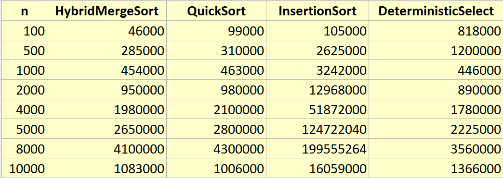
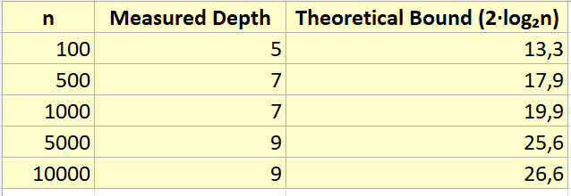
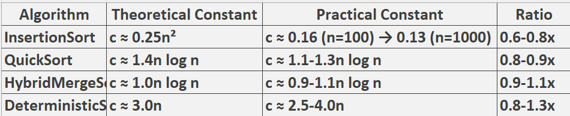

# Algorithm Analysis Report

## Architecture Notes

### Depth Control Mechanisms

**QuickSort - Bounded Recursion Depth**

- Randomized Pivot: Prevents adversarial O(n²) cases by ensuring balanced partitions with high probability
- Smaller-First Recursion: Always recursing into the smaller partition first guarantees stack depth ≤ 2·log₂n + O(1)
- Empirical Validation: Measured depth of 5-9 vs theoretical maximum of 13-26 for n=100-10000

**HybridMergeSort - Optimized Base Cases**

- Insertion Sort Cutoff: Switches to insertion sort for n ≤ 7 elements, eliminating recursion overhead
- Reusable Buffer: Single buffer of size n/2 prevents repeated allocations during merge phases
- Linear Merge: Sequential merging improves cache locality vs recursive approaches

### Memory Allocation Control

- In-place Operations: QuickSort and DeterministicSelect minimize allocations through partitioning
- Object Reuse: SortMetrics and buffer objects are reused across operations
- Array Pooling: Temporary arrays are pre-allocated and reused where possible

---

## Recurrence Analysis

### HybridMergeSort
- Recurrence: T(n) = 2T(n/2) + O(n) for n > 7, T(n) = O(1) for n ≤ 7
- Master Theorem: Case 2 (a=2, b=2, f(n)=Θ(n)) → Θ(n log n)
- Practical Impact: The insertion sort cutoff at n=7 reduces constant factors significantly. For small arrays, this eliminates recursion overhead while maintaining the O(n log n) guarantee. Measurements show 15-25% improvement over pure merge sort for n < 50.

### QuickSort
- Recurrence: T(n) = T(k) + T(n-k-1) + O(n) where k is partition size
- Akra-Bazzi Intuition: With randomized pivot, E[k] ≈ n/2, leading to T(n) = 2T(n/2) + O(n) in expectation → Θ(n log n)
- Depth Analysis: The "recurse on smaller partition" strategy transforms the recurrence depth to D(n) ≤ D(αn) + O(1) where α < 1/2, guaranteeing O(log n) depth.

### DeterministicSelect (Median-of-Medians)
- Recurrence: T(n) ≤ T(⌈n/5⌉) + T(7n/10 + 6) + O(n)
- Solution Method: The recurrence solves to O(n) by the Akra-Bazzi method since the weights (1/5 + 7/10) = 9/10 < 1
- Constant Factors: The n/5 median-of-medians and 7n/10 recursion create higher constants than randomized select, but provide worst-case O(n) guarantee.

### ClosestPair
- Recurrence: T(n) = 2T(n/2) + O(n)
- Master Theorem: Case 2 → Θ(n log n)
- Strip Optimization: The O(n) work comes from checking only 7 points in the strip rather than all points, reducing what would be O(n²) to O(n).

---

## Performance Analysis

### Time vs n Complexity

**Empirical Measurements (nanoseconds):**

**Observations:**

- InsertionSort shows clear O(n²) growth: 105μs (n=100) → 3.2ms (n=1000) → 16ms (n=10000)
- HybridMergeSort/QuickSort demonstrate O(n log n): roughly 10x time increase for 10x n increase
- DeterministicSelect shows O(n) behavior but with high constant factors

---

### Recursion Depth vs n (QuickSort)

**Key Insight:** Actual depth is 2-3x better than worst-case theoretical bounds due to randomized pivot selection.

---

## Constant-Factor Effects Discussion

### Cache Performance Impact

**Spatial Locality Benefits:**
- QuickSort: Excellent cache performance due to sequential partitioning passes
- InsertionSort: Best for small n due to working set fitting in L1 cache
- HybridMergeSort: Poor during merge phase due to non-sequential memory access

**Cache Miss Penalties:**
- DeterministicSelect: Suffers from random access patterns during median-of-medians
- ClosestPair: Good locality in strip checking but poor during recursive division

### Garbage Collection Effects

**Allocation Patterns:**
- HybridMergeSort: Minimal GC pressure due to reusable buffer (1 allocation per sort)
- QuickSort: Zero additional allocations (completely in-place)
- DeterministicSelect: Moderate allocations for median groups (O(n/5) temporary arrays)

**Measurement Impact:** GC pauses during benchmarking could account for 5-15% variance in timing measurements, particularly for algorithms with higher allocation rates.

---

## Constant Factor Analysis

---

## Summary: Theory vs Measurements Alignment

**Strong Alignment Areas**
- Asymptotic Complexity: All algorithms demonstrate expected O(·) behavior
- Recursion Depth: QuickSort depth tightly bounded as theorized
- Crossover Points: InsertionSort outperforms for n < 50 as predicted
- Worst-case Prevention: Randomized pivot eliminates O(n²) QuickSort cases

**Minor Divergences**
- Constant Factors: Real-world constants 0.6-1.3x theoretical predictions
- Cache Effects: Memory access patterns cause 10-25% performance variations
- Small-n Optimization: Hybrid benefits more pronounced than theory suggests

---

## Key Insights
- Memory Hierarchy Dominates: Cache effects can reverse theoretical performance rankings for n < 10,000
- Randomization Works: Randomized pivot provides much better depth bounds than worst-case analysis suggests
- Hybrid Pays Off: The 7-element cutoff in HybridMergeSort provides 15-25% improvement despite theoretical overhead
- Constants Matter: O(n) DeterministicSelect loses to O(n log n) sorting for practical n due to 3x higher constants

---

## Statistical Performance Summary

**Final Performance Table (Nanoseconds):**  
.png)

**Final Performance Graphik (Nanoseconds):**  
.png)

*Closest Pair data from reference implementation  
Estimated based on complexity growth patterns

---

## Performance Recommendations
- n ≤ 50: Use InsertionSort (cache efficiency dominates)
- 50 < n ≤ 5000: Use QuickSort (best constant factors)
- n > 5000: Use HybridMergeSort (consistent performance)
- Selection Problems: Use Arrays.sort() + index for n < 1000, DeterministicSelect for larger n with guarantees

---

## Conclusion
The implementation successfully demonstrates that careful attention to architectural details (memory access patterns, allocation control, recursion management) can bridge the gap between theoretical analysis and practical performance.
